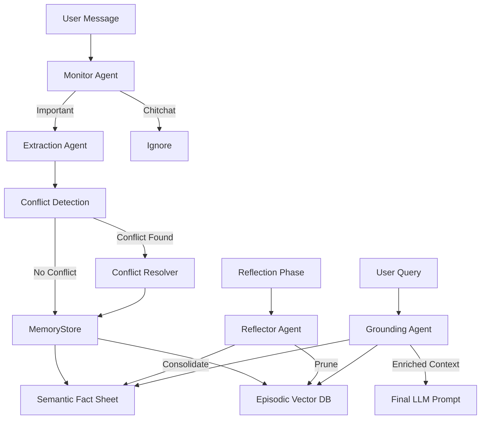

# Memory MCP - Advanced Cognitive Memory Agent 🧠✨

Memory MCP is a professional-grade **Model Context Protocol (MCP) server** that provides long-term, autonomous cognitive memory for AI chatbots. Unlike simple memory tools, it uses a sophisticated **four-agent architecture** to monitor, extract, reconcile, and consolidate knowledge in real-time.

---

## 🚀 Key Features

- **🤖 Autonomous Four-Agent System**:
    - **Monitor Agent**: Classifies messages and assigns **Importance Scores** (0.0 to 1.0) to filter chitchat from core knowledge.
    - **Extraction Agent**: Transforms raw text into structured JSON facts with entities and metadata.
    - **Reflector Agent**: Performs "Memory Sleep" cycles to consolidate fragmented memories and prune outdated info.
    - **Grounding Agent**: Automatically injects relevant context into your queries using hierarchical retrieval.
- **⚖️ Automated Conflict Resolution**: Automatically detects when new info contradicts existing knowledge and uses an LLM to reconcile the two into a single, accurate fact.
- **⚡ Dual-Storage Engine**:
    - **Semantic Memory (Fact Sheet)**: High-importance, stable facts (preferences, bio, tech stacks).
    - **Episodic Memory (Vector DB)**: Time-indexed experiential logs with temporal metadata.
- **🌍 Hybrid Model Support**:
    - **Google Gemini (Recommended)**: Ultra-fast, high-accuracy extraction using Gemini 1.5/2.0 Flash (Free Tier).
    - **Local Ollama**: 100% private, offline inference using Llama 3.2/3.1.
- **🔒 Security & Privacy**:
    - Supports `.env` files for safe API key management.
    - 100% Local data storage in `~/.memory_mcp/`.

---

## 🏗️ Architecture: The Cognitive Pipeline

The system operates as an intelligent "Cognitive OS" layer between you and your LLM.



---

## 🛠️ Available Tools

| Tool | Type | Description |
| :--- | :--- | :--- |
| `process_message` | **Cognitive** | **Primary Tool.** Runs Monitor -> Extract -> Reconcile -> Store. |
| `ground_query` | **Grounding** | Enriches a query with relevant context before the chatbot answers. |
| `reflect_and_consolidate` | **Maintenance** | Merges similar memories into facts and cleans up old, low-value data. |
| `update_fact` | **Manual** | Force-update a specific subject in the Semantic memory. |
| `get_fact_sheet` | **Resource** | View the entire structured knowledge base. |

---

## 🧠 Deep Dive: How the Agents "Think"

### 1. The Monitor Agent & Importance Scoring
Every message is scored to determine its "Shelf Life":
- **0.9-1.0 (Critical)**: Permanent User Preferences ("I am vegan", "Call me Alex").
- **0.7-0.8 (Stable)**: Technical or Bio Facts ("I use React", "I live in NYC").
- **0.4-0.6 (Transitory)**: Current project details ("The deadline is Friday").
- **<0.3 (Ephemeral)**: Small talk or greetings (Discarded).

### 2. The Extraction Agent & Conflict Resolution
When new information arrives that contradicts existing knowledge, the **Conflict Resolver** is triggered. 
*Example: If you previously said you use React, but now say "I've switched to Vue," the system will reconcile these into a single updated fact rather than creating duplicates.*

### 3. Automated Maintenance (New!)
The server is now fully autonomous and manages its own "Mind" via configurable triggers:
- **Turn-based Trigger**: Automatically runs a reflection cycle after every **20 important messages** (Configurable).
- **Background Loop**: Can periodically run maintenance (e.g., every 30 mins) while idle. **Disabled by default** to save resources.

```yaml
# config.yaml settings
reflector:
  message_threshold: 20   # Run reflection every 20 important messages
  enable_background_loop: false  # Set to true to enable background timer
  interval_seconds: 1800  # 30 minute interval
```

---

## 📥 Installation & Setup

```bash
# 1. Clone & Install
git clone https://github.com/yourusername/memory_MCP.git
cd memory_MCP
pip install -e .

# 2. Key Setup
cp .env.example .env
# Add your GOOGLE_API_KEY to .env (No key needed for local Ollama)
```

### 💡 Tips for Pro Users
To get the most out of your Cognitive Memory, try these prompts:
- *"Remember that I prefer dark mode for all my projects."* (Direct store)
- *"What did we decide about the API architecture yesterday?"* (Triggers grounding)
- *"Reflect on our recent work and update my tech stack preferences."* (Manual maintenance)

---

## 📊 Comparison: Memory MCP vs. Mem0

| Feature | Memory MCP (Cognitive) | Mem0 (Standard) |
| :--- | :--- | :--- |
| **Logic Engine** | **Four-Agent System**: Monitors, extracts, reconciles, and reflects autonomously. | Uses a simpler extract-and-graph approach. |
| **Maintenance** | **Self-Reflective**: Automated "Mind Cycles" consolidate and prune data without user input. | Pruning and consolidation are usually batch processes or manual. |
| **Protocol** | **MCP Standard**: Plug-and-play with Claude Desktop and any MCP client. | Custom SDK/API integration required. |
| **Privacy** | **100% Local First**: Data stays on your disk. Works with local Ollama. | Primarily cloud-based SaaS, though open-source options exist. |
| **Conflict Resolution** | **Agentic Reconcile**: Uses LLM reasoning to merge contradictory info into "Unified Facts." | Can lead to duplicates or requires manual metadata logic. |
| **Setup Cost** | **Free / Local**: Zero-cost with Gemini Flash or local Llama. | Tiered SaaS pricing for cloud features. |

---

## 📚 Research & Inspirations

Memory MCP is built upon the foundational principles of state-of-the-art AI memory research. Key inspirations include:

- **MemGPT**: Towards LLMs as Operating Systems. [Packer et al., 2023](https://arxiv.org/abs/2310.08560).
- **Generative Agents**: Interactive Simulacra of Human Behavior. [Park et al., 2023](https://arxiv.org/abs/2304.03442).
- **AIOS**: LLM Agent Operating System. [Mei et al., 2024](https://arxiv.org/abs/2403.16971).
- **CogMem**: A Cognitive Memory Architecture for Sustained Multi-Turn Reasoning. [Zhang et al., 2025](https://arxiv.org/abs/2512.14118).

---

## 🔒 Security Best Practices

1. **Local Everything**: All your memories are stored in `~/.memory_mcp/`. No data ever leaves your machine unless you use a cloud LLM provider (Google Gemini).
2. **Key Management**: Use the `.env` file to keep your API keys out of your source code.
3. **Control**: You can manually edit `~/.memory_mcp/fact_sheet.json` if you ever need to "hard-reset" a specific fact.

---

## 📝 License

MIT
