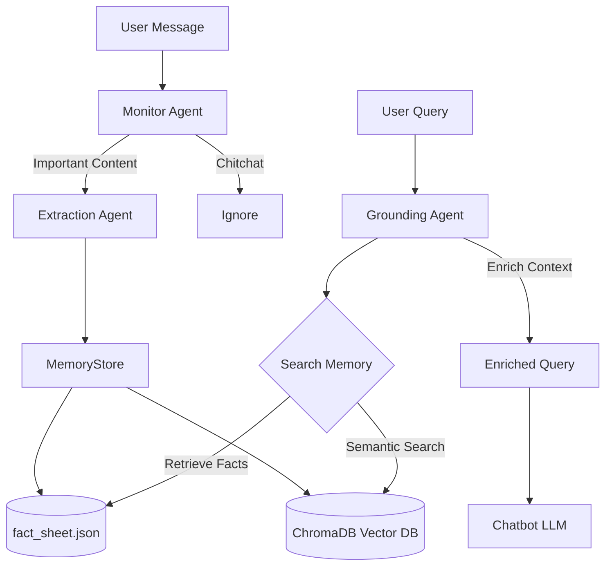

# Memory MCP Server
# Memory MCP - Advanced Memory Agent

A **Model Context Protocol (MCP) server** that provides long-term memory capabilities for AI chatbots using an autonomous three-agent architecture.

## Features

### 🤖 Three-Agent Architecture
- **Monitor Agent** (Llama 3.2 3B): Real-time message classification
- **Extraction Agent** (Llama 3.1 8B): Structured fact extraction
- **Grounding Agent**: Context injection before responses

### 💾 Dual Storage System
- **Structured Fact Sheet**: Human-readable JSON for static knowledge
- **Vector Database**: ChromaDB for semantic search of conversations

### 🔒 100% Local & Private
- All processing happens on your machine
- No external API calls required
- Data stored in `~/.memory_mcp/`

## How It Works

```
User Message → Monitor Agent → Extraction Agent → MemoryStore
                    ↓                                    ↓
              (Filter chitchat)              (Store with metadata)
                                                         ↓
User Query → Grounding Agent → Retrieve Facts → Enrich Context → Chatbot
```

# Memory MCP - Advanced Autonomous Memory Agent 🧠

Memory MCP is a professional-grade **Model Context Protocol (MCP) server** that provides long-term, autonomous memory for AI chatbots. Unlike simple memory tools, it uses a sophisticated **three-agent architecture** to monitor conversations, extract structured knowledge, and ground future responses in real-time.

---

## 🚀 Key Features

- **🤖 Autonomous Three-Agent System**:
    - **Monitor Agent**: Classifies every message as "important" or "chitchat" to keep your memory clean.
    - **Extraction Agent**: Transforms raw text into structured JSON facts with entities and metadata.
    - **Grounding Agent**: Automatically injects relevant context into your queries before the chatbot answers.
- **⚡ Dual-Storage Engine**:
    - **Structured Fact Sheet**: A human-readable JSON file (`fact_sheet.json`) for static knowledge (preferences, tech stacks, bio).
    - **Vector Search**: Semantic search via ChromaDB for digging through historical conversation context.
- **🌍 Hybrid Model Support**:
    - **Google Gemini (Recommended)**: Ultra-fast, high-accuracy extraction using Gemini 1.5/2.0 Flash (Free Tier).
    - **Local Ollama**: 100% private, offline inference using Llama 3.2/3.1.
- **🔒 Security & Privacy**:
    - Supports `.env` files for safe API key management.
    - 100% Local data storage in `~/.memory_mcp/`.

---

## 🏗️ Architecture



---

## 🛠️ Prerequisites

- **Python 3.10+**
- **Google AI Studio API Key** (Get it free at [aistudio.google.com](https://aistudio.google.com))
- (Optional) **Ollama** for local execution.

---

## 📥 Installation

```bash
# 1. Clone the repository
git clone https://github.com/yourusername/memory_MCP.git
cd memory_MCP

# 2. Install dependencies
pip install -e .

# 3. Dedicated .env setup
cp .env.example .env
# Open .env and add your GOOGLE_API_KEY
```

---

## ⚙️ Configuration

The system is highly configurable via `config.yaml`. You can mix and match providers (e.g., use Gemini for monitoring and Ollama for storage).

### Google Gemini Setup (Default)
```yaml
monitor:
  provider: "google"
  model: "gemini-flash-latest"

google:
  api_key: "YOUR_KEY" # Or set GOOGLE_API_KEY in .env
```

### Local Ollama Setup
```yaml
monitor:
  provider: "ollama"
  model: "llama3.2:3b"
```

---

### Claude Desktop Setup

Add this to your `claude_desktop_config.json`. **Note**: Since you have a `.env` file in the project directory, the `env` section here is optional as the server will automatically load your `.env` key.

```json
{
  "mcpServers": {
    "memory": {
      "command": "python3",
      "args": ["/Users/YOUR_USER/memory_MCP/src/memory_mcp/server.py"],
      "cwd": "/Users/YOUR_USER/memory_MCP"
    }
  }
}
```

---

## 🔒 Security Best Practices

1. **Use `.env`**: Always prefer storing your `GOOGLE_API_KEY` in the `.env` file. It's excluded from Git via `.gitignore`.
2. **Avoid Hardcoding**: Never paste your API key directly into `config.yaml` or `server.py`.
3. **Environment Variables**: If you are using a CI/CD pipeline or a different MCP client, you can also set `GOOGLE_API_KEY` as a system environment variable.

---

## 🛠️ Available Tools

### 1. `ground_query`
The primary tool for context injection. Call this before asking the chatbot a question to ensure it "remembers" you.
- **Input**: `query` (str)
- **Action**: Searches Fact Sheet & Vector DB, returns enriched context.

### 2. `store_memory`
Manually store a specific piece of information in the semantic vector database.
- **Input**: `content` (str)

### 3. `update_fact`
Manually update or override a topic in the structured fact sheet.
- **Input**: `topic` (str), `content` (str)

### 4. `get_fact_sheet`
View the entire structured knowledge base currently stored in memory.

---

## 🧠 How the Agents Work

### 1. The Monitor Agent
Every message you send is first analyzed by a lightweight agent (Gemini Flash or Llama 3b). It ignores "Hi", "Thanks", and small talk, focusing only on "Knowledge Delta" (new info).

### 2. The Extraction Agent
Flagged messages are sent here. It extracts:
- **Topic**: The high-level category.
- **Content**: The core fact.
- **Entities**: Key names, techs, or places.
- **Category**: Classifies as "preference", "project", or "fact".

### 3. The Grounding Agent
When you ask a question like *"What should I use for my backend?"*, the Grounding Agent retrieves your previously stored backend preferences (e.g., *"Uses FastAPI and PostgreSQL"*) and injects them into the current prompt.

---

## 📊 Comparison: Why Memory MCP?

| Feature | Memory MCP | Simple Vector DB | Mem0 (SaaS) |
|---------|------------|------------------|-------------|
| **Structure** | Fact Sheet + Vector | Vector Only | Knowledge Graph |
| **Privacy** | 100% Local Files | Usually Local | Cloud-based |
| **Logic** | Autonomous Agents | Manual Storage | Automatic |
| **Cost** | Free (Local/Gemini) | Free | Subscription |
| **Editing** | Direct JSON edit | Hard to manually edit | API only |

---

## 📝 License

MIT

## 🤝 Contributing

Contributions are welcome! Whether it's adding a new provider or improving the extraction prompts, feel free to open a PR.
